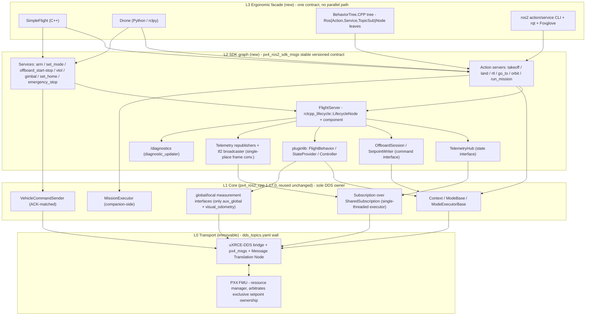

# RFC: `px4_ros2_sdk` — a ROS 2-native flight SDK layered strictly-additively on `px4_ros2_cpp`

Contributed by RIIS, LLC (https://www.riis.com).

Status: Draft for review. The design is held to three standards throughout: ROS-native fit, uXRCE-DDS feasibility, and aerospace correctness.

Evidence base (pinned): `px4_ros2_cpp` @ 1.17.0 (this checkout), PX4-Autopilot @ `v1.18.0-alpha1-20-gcacd127f75`, `dds_topics.yaml` at `src/modules/uxrce_dds_client/dds_topics.yaml` (66 topic entries: 28 `fmu/out` including the one commented `vehicle_angular_velocity`, 38 `fmu/in`, no services block). Every reachability and code claim in this RFC was grepped against those trees; provenance is stated inline where it is load-bearing.

---

## 1. Motivation and design philosophy

PX4 already ships a first-class ROS 2 bridge (uXRCE-DDS) and a mode-authoring library (`px4_ros2_cpp`). What it does not ship is a robotics-middleware-shaped command-and-observe surface: there is no managed-lifecycle bringup, no action servers for long maneuvers, no curated-QoS telemetry in standard ROS types, no pluginlib extension points, no `/diagnostics`, and no ergonomic scripting client. Application authors reimplement those conventions per project, usually by talking raw `px4_msgs` uORB mirrors, which reintroduces the same silent killers every time: NED/FRD frame confusion, FMU-clock versus ROS-clock time-base mixing, and treating a command ACK as physical completion.

`px4_ros2_sdk` is the merge of two disciplines.

From ROS 2 robotics middleware it takes the interface-choice discipline that Nav2, MoveIt 2, `ros2_control`, Autoware, and Aerostack2 all converged on: atomic non-preemptible operations are services, long progress-bearing cancellable operations are action servers, high-rate streams are topics with curated QoS, readiness is a managed-node lifecycle rather than a constructor side effect, swappable behavior is `pluginlib`, health is `diagnostic_msgs`, and an ergonomic simple-commander client (the Nav2 `BasicNavigator` / MoveIt `MoveGroupInterface` / Aerostack2 `DroneInterface` pattern) wraps the exact same graph so scripts and production never diverge.

From aerospace practice it takes honesty about the vehicle: setpoints-out and telemetry-in are typed, named, unit-and-frame-carrying command/state interfaces (the `ros2_control` `CommandInterface`/`StateInterface` model) whose exclusive ownership is arbitrated by PX4 itself; every command `Result` carries the FMU ACK and never claims physical completion (completion rides `mode_completed`); and the reachability wall drawn by `dds_topics.yaml` is surfaced rather than faked.

The SDK is ROS-native first and strictly additive. `px4_ros2_cpp` is treated as the device-driver core, the sole owner of uXRCE-DDS endpoints, exactly as `ros2_control`'s Resource Manager owns hardware and Aerostack2's `AerialPlatform` owns vehicle I/O. Every subscription still flows through the library's `SharedSubscription`; every command still flows through `VehicleCommandSender`. The SDK adds no new `/fmu` endpoints beyond `px4_ros2_cpp`: its companion-side action/service/topic graph does add ROS 2 (DDS) entities, but nothing new crosses the uXRCE-DDS bridge to the FMU. It is one graph with one contract; the ergonomic facade, a BehaviorTree.CPP tree, the CLI, and rqt are all clients of that one graph.

---

## 2. Current-state gap analysis

### 2.1 What `px4_ros2_cpp` provides that the SDK keeps and depends upon

This layer is reused as-is and is the only thing in the stack that touches `px4_msgs` and DDS. Verified primitives in this 1.17.0 checkout:

- `Context` (an `rclcpp::Node&` plus a `topic_namespace_prefix`), the per-vehicle namespacing convention the SDK builds swarm on.
- `ModeBase` and `ModeExecutorBase`: the `register_ext_component` handshake, `nav_state` mode IDs (`kModeIDRtl`, `kModeIDLand`, `kModeIDDescend`, `kModeIDLoiter` are all defined in `mode.hpp`), `replaceInternalMode` fallback, and async verbs `takeoff(cb, altitude, heading)`, `land(cb)`, `rtl(cb)`, `arm(cb, run_preflight_checks)`, `disarm(cb, forced)`, `waitReadyToArm(cb)`, `controlAutoSetHome(enabled)` (`mode_executor.hpp:102-138`). All completion is delivered through a `CompletedCallback(Result)`; none of these verbs block on the executor thread.
- The `SetpointBase` family declaring `getSetpointType()`, `desiredUpdateRateHz()`, and `clearOptionalRequirements(SetpointConfigReply&)`, with concrete multicopter, fixed-wing, rover, attitude, rates, thrust/torque, trajectory, goto, and direct-actuator subtypes already present.
- `Subscription<T>` over `SharedSubscription<T>`: one best-effort depth-1 DDS subscription per `(node, topic)`, RAII ordered callbacks, cached `last()`. This is where the additive invariant is enforced physically: N SDK consumers of one topic share one DDS subscription.
- `VehicleCommandSender`: ACK-matched command dispatch (3 x 300 ms retry to a `Result`), backed by `vehicle_command` out and `vehicle_command_ack` in.
- `waitForFMU`, `messageCompatibilityCheck` (over a caller-supplied topic set, with `_v<N>` message versioning via `getMessageNameVersion<T>()`), and the companion-side `MissionExecutor`.

Two facts from this layer are load-bearing for the whole SDK and are treated as design constraints, not incidental details:

1. `SharedSubscription` documents in-header (`shared_subscription.hpp:36`) that it "Assumes the use of a single-threaded executor." Section 4.4 makes concurrency a first-class design section because of this.
2. A `ModeBase` that streams setpoints activates a setpoint type only when it receives a matching `SetpointConfigReply` from the FMU. `setActive(true)` fires inside the `setpoint_config_reply` subscription callback (`mode.cpp:60-64`), and the fallback comment at `mode.cpp:407` confirms "setActive() will be called when we get a matching reply from PX4." This is a real FMU handshake over `fmu/in/setpoint_config` and `fmu/out/setpoint_config_reply`, and it gates every streamed-setpoint surface. Section 2.3 addresses the firmware skew this creates.

### 2.2 The `dds_topics.yaml` reachability boundary (immovable, not ours)

The bridge configuration is the hard wall. Confirmed by grep of the pinned firmware: there is no parameter topic, no mission upload/download topic, no geofence-config topic, no RTCM/GPS-injection topic, no log/ulog-download topic, no firmware/UID identity topic, no `esc_status`, no `actuator_outputs` feedback, no structured FMU event topic, and no services block at all (uXRCE-DDS has no service layer; every ROS service in this SDK is therefore companion-side only). uXRCE-DDS also has no `SET_MESSAGE_INTERVAL` equivalent, so no real message-rate control exists. These are honest non-goals (Section 7), not evasions, and each is confirmed absent rather than assumed absent.

### 2.3 The firmware-versus-library `setpoint_config` skew

This is the sharpest reachability constraint in the RFC: the SDK's mandated streaming core requires two topics that the pinned `v1.18.0-alpha1` firmware does not bridge.

Verified: `grep setpoint_config src/modules/uxrce_dds_client/dds_topics.yaml` on this `v1.18.0-alpha1-20` checkout returns nothing, and no `SetpointConfig.msg` exists anywhere under that firmware's `msg/` tree. Meanwhile `px4_ros2_cpp` 1.17.0 lists `fmu/in/setpoint_config` and `fmu/out/setpoint_config_reply` as required topics in `message_compatibility_check.hpp:32,48` and gates `setActive(true)` on the reply as described above. The library depends on a newer `px4_msgs` (which defines `SetpointConfig`) than this firmware line publishes.

Consequence, stated plainly: against this exact firmware, every streamed-setpoint path (offboard fast path, the goto-streaming variant, the companion mission executor, and any setpoint-producing behavior plugin) would publish setpoints the FMU never arbitrates active. `messageCompatibilityCheck` would in fact fail closed on the missing topics during `on_configure`, which is the honest outcome, but the point stands that the streaming surfaces are not verifiable on this checkout.

Resolution adopted by this RFC:

- The L0 inventory lists `fmu/in/setpoint_config` and `fmu/out/setpoint_config_reply` as REQUIRED for the streaming surfaces. The SDK pins L0 to the PX4 firmware line whose `dds_topics.yaml` bridges these two topics and whose `px4_msgs` defines `SetpointConfig` (the line `px4_ros2_cpp` `main` already targets). Non-streaming surfaces (bringup, arm, takeoff/land/rtl, all telemetry, health, VTOL/gimbal/payload commands, emergency-stop, set-mode) do not touch this handshake and are reachable on the pinned `v1.18.0-alpha1-20` today.
- Phasing (Section 6) exploits this split: the first PR delivers exactly the non-streaming safe core, which is verifiable now; the streaming phases are gated on the firmware that bridges `setpoint_config`/`setpoint_config_reply` and must be verified there. A streaming smoke test on `v1.18.0-alpha1-20` proves nothing and is explicitly disallowed as a validation gate.

---

## 3. Proposed architecture and layering

Four strict layers, each additive over the one below. Nothing above L1 opens an `/fmu` endpoint; all uXRCE-DDS traffic to the FMU stays owned by L1 (the companion-side ROS graph above L1 does add its own DDS entities).

**L0 Transport (immovable, not ours).** The uXRCE-DDS bridge, `dds_topics.yaml`, `px4_msgs`, and the Message Translation Node. The hard reachability wall of Section 2.2, which Section 2.3 refines to require `setpoint_config`/`setpoint_config_reply` for streaming.

**L1 Core (`px4_ros2_cpp`, reused unchanged, additive-only).** The Section 2.1 primitives. The only code that imports `px4_msgs` endpoints or touches DDS. The `ros2_control` ResourceManager / Aerostack2 `AerialPlatform` analogue. Invariant enforced by design: L2 and above never import `px4_msgs` endpoints or touch DDS themselves; they use the L1 primitives (`Subscription`/`SharedSubscription`, `VehicleCommandSender`, `ModeExecutorBase`) either directly or through the L2 `TelemetryHub`/`SetpointWriter`/`OffboardSession` wrappers defined in Section 4.1.

**L2 SDK graph (new, the bulk of the SDK).** A command/state-interface abstraction over L1 (`TelemetryHub` = state interface; `SetpointWriter`/`OffboardSession` = command interface), and `FlightServer`, a `rclcpp_lifecycle::LifecycleNode` and `rclcpp_components` component that owns one hidden `ModeExecutorBase` (autonomy verbs), an `OffboardSession` (a hidden registered `ModeBase` for streaming), and the `TelemetryHub`, and hosts the action servers, services, telemetry republishers, the tf2 broadcaster, `/diagnostics`, and the `pluginlib` behavior/estimator/controller plugins. A Nav2-style `lifecycle_manager` with bond heartbeats drives deterministic `configure -> activate` bringup. Long tasks are actions, one-shots and config are services, streams are topics with curated QoS.

**L3 Ergonomic facade (new).** `px4_ros2_simple_commander`: a C++ `SimpleFlight` and a Python `Drone` (rclpy) client that wrap the exact same L2 action/service graph. Blocking and async `arm`/`takeoff`/`goTo`/`land`/`returnToLaunch`/`orbit`/`runMission` plus `isTaskComplete`/`getFeedback`/`getResult`/`cancelTask`/`connect`/`waitUntilReady`. This is a distinct rclpy client of the L2 graph, not to be confused with the existing `px4_ros2_py` pybind11 binding of the L1 mode-authoring core; there is no accidental second command path.

Cross-cutting: everything is namespaced by `vehicle_id` via the L1 `topic_namespace_prefix`, so N vehicles are N identical namespaced stacks and swarm is free. A fast path (the L2 offboard streaming topics) bypasses behaviors so simple offboard control does not traverse five layers (the Aerostack2 latency anti-pattern, avoided). The stable `px4_ros2_sdk_msgs` contract plus the curated public API is explicitly separate from the raw `px4_msgs` uORB-mirror topics (Autoware AD API discipline). The known-misspelled L1 accessors (`Battery::remaningFraction` at `battery.hpp:59`, `MissionExecutor::onReadynessUpdate` at `mission_executor.hpp:96`, `MissionExecutor::setActvityInfo` at `mission_executor.hpp:457`, all confirmed real in this checkout) never leak into the stable surface; the SDK wraps them behind correctly-spelled contract members.

### 3.1 Layering and graph diagram



---

## 4. Object and node/graph model

### 4.1 C++ object model, bottom to top

L1 (reused unchanged): `Context`, `ModeBase`, `ModeExecutorBase`, the `SetpointBase` subtypes, `Subscription<T>` over `SharedSubscription<T>`, `VehicleCommandSender`, `MissionExecutor`, `waitForFMU`, `messageCompatibilityCheck`.

L2 new abstractions:

- `TelemetryHub` (state interface, the `ros2_control` `StateInterface` analogue): cached synchronous getters (`last()`/`lastValid()`) plus RAII `onUpdate` handles, built entirely on `Subscription<T>`/`SharedSubscription<T>`, resolving the `_v<N>` version suffix per topic. Adds zero DDS load. Because `SharedSubscription` assumes a single-threaded executor, the hub documents which calls are executor-thread-only.
- `SetpointWriter` / `OffboardSession` (command interface, the `ros2_control` `CommandInterface` and Aerostack2 `motion_reference_handlers` analogue): typed `send_velocity`/`send_position`/`send_attitude`/`send_rates`/`send_thrust_torque` that select the correct `SetpointBase` subtype inside a hidden registered `ModeBase`, negotiate setpoint type and rate over the FMU `setpoint_config` handshake, and drive the registered-mode setpoint-update timer at `desiredUpdateRateHz()`. `start()`/`stop()` register and select the hidden mode (name "Offboard (SDK)", `user_selectable`) and enforce seed-before-start. The loss model follows Section 4.4.
- `FlightServer`: the composable `LifecycleNode` of Section 3. `on_configure` runs `waitForFMU` plus `messageCompatibilityCheck` over the union of enabled-capability topics; `on_activate` performs `doRegister` and starts the servers; `on_deactivate`/`on_error` safe-stop and fall back to the replaced internal mode.
- `FlightBehavior` (pluginlib base): `on_configure`/`on_activate`/`on_deactivate` plus `execute(goal, feedback) -> result` and `halt()`; each skill is an action-server leaf and may own a `ModeBase`.
- `StateProvider` (pluginlib base): estimator/aux-injection plugins. Per Section 5.3 this is restricted to the two measurement interfaces L1 actually exposes until L1 is extended.

L3 facade: `SimpleFlight` (C++) and `Drone` (Python/rclpy) are thin action-plus-service clients over `FlightServer`.

### 4.2 Node and graph model

One `FlightServer` per vehicle, namespaced by `vehicle_id` via the L1 `topic_namespace_prefix`. `FlightServer` plus optional `StateProvider`/behavior components load into one `component_container` per vehicle for intra-process comms (`SharedSubscription` already shares one DDS sub per `(node, topic)`). A `lifecycle_manager` drives `configure -> activate` in dependency order with bond heartbeats; the bond payoff is supervising the separately-composed behavior/estimator components, and for a single-node deployment the bond is optional ceremony that can be disabled. The hidden `ModeBase`/`ModeExecutor` register with the FMU so the SDK's offboard and behaviors are real operator-selectable external modes with internal-mode fallback intact. PX4 is the resource manager granting exclusive setpoint ownership to exactly one active mode, so two modes can never fight over setpoints.

### 4.3 Code sketches

C++ `FlightServer` lifecycle skeleton (illustrative):

```cpp
class FlightServer : public rclcpp_lifecycle::LifecycleNode {
public:
  CallbackReturn on_configure(const State&) override {
    // Blocking L1 discovery is allowed HERE only: no setpoint-update timer is
    // running yet, so nothing on the executor has a hard deadline.
    if (!px4_ros2::waitForFMU(*this, std::chrono::seconds(5))) return FAILURE;
    // Scope the version check to the topics the enabled capabilities declare.
    if (!px4_ros2::messageCompatibilityCheck(*this, enabledCapabilityTopics()))
      return FAILURE;              // fails closed on missing setpoint_config, etc.
    telemetry_ = std::make_unique<TelemetryHub>(context_);
    return SUCCESS;
  }
  CallbackReturn on_activate(const State&) override {
    executor_->doRegister();       // register_ext_component handshake
    startActionServers();          // takeoff/land/rtl/go_to/orbit/run_mission
    startServices();               // arm/set_mode/offboard/vtol/gimbal/emergency
    startTelemetry();              // republishers + tf2 + /diagnostics
    return SUCCESS;
  }
private:
  std::unique_ptr<px4_ros2::ModeExecutorBase> executor_;   // hidden autonomy verbs
  std::unique_ptr<OffboardSession> offboard_;              // hidden registered mode
  std::unique_ptr<TelemetryHub> telemetry_;
};
```

`FlightBehavior` pluginlib leaf (illustrative):

```cpp
class MyInspection : public px4_ros2_sdk::FlightBehavior {
  void on_activate() override { /* claim setpoint ownership via owned ModeBase */ }
  Result execute(const Goal& goal, FeedbackFn feedback) override {
    // Runs on the async action-executor path; must not block the ROS executor
    // thread that services the setpoint-update timer.
  }
  void halt() override { /* release, fall back to replaced internal mode */ }
};
```

C++ `SimpleFlight` facade (illustrative):

```cpp
px4_ros2_sdk::SimpleFlight flight(node, "/vehicle_1");
flight.connect();                 // waitForFMU + lifecycle activate, then ready
flight.waitUntilReady();
flight.arm();                     // blocking: returns on FMU ACK Result
flight.takeoff(5.0f);             // blocking: returns on mode_completed, not ACK
flight.goTo(pose);                // blocking with progress; cancellable
flight.returnToLaunch();
```

Python `Drone` facade (illustrative):

```python
drone = Drone(node, namespace="/vehicle_1")
drone.connect()
drone.wait_until_ready()
drone.arm()                       # blocks on FMU ACK
drone.takeoff(altitude=5.0)       # blocks on mode_completed
handle = drone.go_to(pose, blocking=False)
while not drone.is_task_complete(handle):
    print(drone.get_feedback(handle).distance_remaining_m)
drone.land()
```

### 4.4 Concurrency and the single-threaded-executor deadline (first-class design section)

This is the sharpest technical risk in the SDK, and it is a design section rather than a footnote because `SharedSubscription` requires a single-threaded executor (`shared_subscription.hpp:36`).

On that one executor `FlightServer` must service action servers, republish telemetry, and drive the registered-mode setpoint-update timer, while several L1 operations block: `VehicleCommandSender::sendCommandSync` is up to 3 x 300 ms = ~900 ms, and `doRegister`/`deferFailsafesSync` also wait for an FMU ACK. A blocking call on the executor thread starves the setpoint-update timer, the FMU stops receiving fresh setpoints from the registered mode, the external-component liveness/setpoint-update timeout trips, and PX4 falls back to the replaced internal mode. This is the loss model (see below), and it is a real robotics-versus-hard-deadline collision, not a theoretical one.

Mandates, pinned by test:

- All long or blocking L1 operations are driven through the async `CompletedCallback` paths. `scheduleMode`/`takeoff`/`land`/`rtl`/`arm`/`disarm`/`waitReadyToArm` already take a `CompletedCallback` and must be used that way; nothing blocks the executor once the setpoint-update timer is live.
- The one sanctioned place a blocking L1 discovery call may run is `on_configure` (see 4.3), because no setpoint-update timer is active before `on_activate`. The review's caveat that `waitForFMU`/`doRegister` block inside lifecycle callbacks is acceptable for exactly this reason.
- The phasing measures worst-case cold-start setpoint-update jitter against the registered-mode timer budget. The governing rate is `desiredUpdateRateHz()` (the SetpointBase-declared rate, commonly 50 Hz), not a 2 Hz heartbeat; the budget is stated against that real mechanism.

Offboard loss model (verified). `px4_ros2` registered external modes do NOT publish `offboard_control_mode` and are NOT governed by `COM_OF_LOSS_T`/`COM_OBL_RC_ACT`. A grep for `offboard_control_mode`, `OffboardControlMode`, `COM_OF_LOSS`, `COM_OBL`, and `NAVIGATION_STATE_OFFBOARD` across `px4_ros2_cpp` returns zero hits in this checkout. So the SDK's offboard is not the legacy >2 Hz `OffboardControlMode` heartbeat with a `COM_OF_LOSS_T` fallback; it is a registered external mode arbitrated via the `setpoint_config` handshake, and on setpoint-stream loss the registered-mode setpoint-update timeout trips and `replaceInternalMode` takes over. The legacy `NAVIGATION_STATE_OFFBOARD` path (which would publish `offboard_control_mode` directly and be governed by `COM_OF_LOSS_T`) is a separate non-registered path that bypasses L1 and would open a new `/fmu` endpoint outside L1; adopting it would violate the strictly-additive invariant, so the SDK uses the registered-mode liveness model throughout (Capability 6).

### 4.5 Mode registration and the setpoint requirement model

Two questions decide how the SDK coexists with PX4's mode arbitration: which parts of the SDK register an external mode, and how a mode that carries several setpoint types avoids taking the union of their failsafe requirements.

**What registers, and what does not.**

- Streaming rides exactly one hidden registered mode: `OffboardSession`, a `ModeBase` registered `user_selectable` under the name "Offboard (SDK)", with `replaceInternalMode` set so loss of the setpoint stream falls back to the replaced internal mode (Section 4.4). It is the single SDK-owned mode on the fast path; every command-interface topic maps onto it.
- Custom behaviors (Phase 3) each own their `ModeBase`. Every owned mode consumes one PX4 external-mode/`nav_state` slot, so the concurrent-behavior count is bounded by that slot budget and is a documented, tested ceiling (the "Custom flight behaviors" capability), not a runtime surprise.
- `takeoff`/`land`/`rtl` register no SDK mode. They are actions backed by a hidden `ModeExecutorBase` that schedules the PX4-native `nav_state` modes (`kModeIDTakeoff`/`kModeIDLand`/`kModeIDRtl`) over `fmu/in/vehicle_command_mode_executor`; completion rides `mode_completed`. The executor owns a minimal `ModeBase` only to carry the `register_ext_component` handshake; that owned mode declares no setpoint type and streams nothing. (The P0 slice issues `VEHICLE_CMD_NAV_TAKEOFF` through `VehicleCommandSender` directly and defers this executor wiring, as the scaffold README and header state.)

**Registration and the message-compatibility scope.** `ModeExecutorBase::doRegister` and `ModeBase::doRegister` run `defaultMessageCompatibilityCheck`, which checks the whole `ALL_PX4_ROS2_MESSAGES` set, including `fmu/in/setpoint_config` and `fmu/out/setpoint_config_reply`: the two topics Section 2.3 finds unbridged on `v1.18.0-alpha1-20`. A takeoff/land/rtl-only server must therefore not lean on that built-in check, or its `on_configure` fails closed on that firmware even though it streams nothing. The `FlightServer` disables the built-in check on its hidden modes (`setSkipMessageCompatibilityCheck`) and runs one scoped `messageCompatibilityCheck` over the union of enabled-capability topics (Section 4.3). This is scoping, not skipping (Section 7.2): with only the non-streaming maneuvers enabled the scoped set excludes `setpoint_config`, so the server configures on the pinned firmware; enabling `OffboardSession` adds `setpoint_config`/`setpoint_config_reply` to the scoped set, so the streaming server gates on the firmware that bridges them.

**Per-setpoint-type requirements (the sharpest open point).** A mode's arming/failsafe requirements are the OR of its setpoint types' requirements: `ModeBase::setRequirement` does `modeRequirements() |= flags`, and each `SetpointBase` subtype contributes its own in its constructor (the multicopter global-goto type sets `global_position`; the rates and attitude types set none; the trajectory type carries `local_position` as an optional requirement it can clear). Both `addSetpointType` and `setRequirement` assert the mode is not yet registered, so the requirement set is fixed at registration time.

The failure mode is real: if one hidden mode constructs every setpoint type it can emit, it registers with the union of their requirements, and streaming rates then inherits the position-loss failsafe of the goto type it never uses. The union is the wrong contract.

`OffboardSession` configures requirements per active setpoint type rather than taking the union:

- Requirements a type declares OPTIONAL (the trajectory type's `local_position`, via `clearOptionalRequirements(SetpointConfigReply&)`) are resolved at runtime inside the existing `setpoint_config` handshake, with no re-registration.
- Requirements that are MANDATORY for one type and absent for another (global position for goto versus none for rates) cannot be OR-merged onto a single registration. Because the requirement set is immutable after registration, switching between such types re-registers the hidden mode: the session unregisters, reconstructs the mode declaring only the target type's requirements, and re-registers before the first setpoint of the new type. Where the slot budget allows, the equivalent is one registered mode per requirement class, selected on switch. Either way the registered mode's requirements always match the setpoint type actually streaming, so rate control never carries the position failsafe.

The re-registration cost (a blocking `doRegister` per switch) sits on the type-switch path only, never inside the setpoint-update loop, so it does not collide with the Section 4.4 timer deadline; a type switch is an operator-scale event, not a per-sample one.

---

## 5. Capability table

### 5.1 Reachable capabilities (deliverable on the pinned firmware, or the streaming firmware of Section 2.3)

Each row lists the ROS 2 surface with QoS/lifecycle/plugin, the pattern borrowed, the uORB basis, and the design notes and constraints that shape it. QoS conventions used: SensorData = best_effort, keep_last, depth 1; Latched = RELIABLE, TRANSIENT_LOCAL, depth 1; Command = RELIABLE.

| Capability | ROS 2 surface (QoS / lifecycle / plugin) | Borrows from | uORB basis | Design notes and constraints |
|---|---|---|---|---|
| Bringup, connection, message-compat gating | `FlightServer` LifecycleNode + component under `lifecycle_manager` + bond; `waitForFMU` + `messageCompatibilityCheck` (union of enabled caps) in `on_configure`, `register_ext_component` in `on_activate`; `~/connection_state` Latched. No new `/fmu` endpoints. | Nav2 `lifecycle_manager` + bond; ROS 2 managed nodes | `vehicle_status`, `register_ext_component_request`/`reply`, `unregister_ext_component`, `message_format_request`/`response` | Bond payoff is multi-component supervision; optional for a single-node deployment. Blocking calls confined to `on_configure` per 4.4. |
| Arm / Disarm | Service `~/arm` (Command QoS): `{arm, run_preflight_checks, force}` -> `{accepted, Result, reason}`. Armed transition confirmed on Latched `~/vehicle_state`, not inferred from return. | ROS interface-choice rule; `ros2_control` `switch_controller`; MoveIt services | `vehicle_command` (COMPONENT_ARM_DISARM=400; force -> param2=21196), `vehicle_command_ack`, `vehicle_status` | Routed through `ModeExecutorBase::arm(cb, run_preflight_checks)`/`waitReadyToArm` so FMU owns readiness gating, not the companion. ACK != completion preserved. |
| Takeoff / Land / RTL | Actions `~/takeoff`, `~/land`, `~/return_to_launch` (feedback altitude/distance/eta; result Result); backed by hidden `ModeExecutorBase`. Succeeds on `mode_completed`, not ACK. | Nav2 `NavigateToPose` | `ModeExecutorBase` -> `nav_state` AUTO_TAKEOFF/LAND/RTL via `vehicle_command_mode_executor`; `mode_completed`; NAV_RETURN_TO_LAUNCH=20; `home_position`, `vehicle_local_position` | Strongest surface: PX4 owns the maneuver and its failsafes; no setpoint streaming, so no `setpoint_config` dependency. `RESULT_FAILURE_OTHER == Result::ModeFailureOther` asserted in `mode.hpp`. |
| Go-to-location (single waypoint) | Action `~/go_to` (goal `PoseStamped` local or `GeoPose` global; `max_speed_mps`; yaw mode; feedback `distance_remaining_m`; result Result). Two explicit mechanisms, not interchangeable (see note). | Nav2 `goToPose`; Aerostack2 `go_to` | `goto_setpoint` (multicopter only) OR `vehicle_command` DO_REPOSITION=192; `vehicle_local_position`, `vehicle_global_position` | MC-local uses streamed `goto_setpoint` (inherits `setpoint_config` handshake; success is SDK-computed from a distance threshold, no `mode_completed`). Global GeoPose and fixed-wing/rover route through DO_REPOSITION (one-shot, no handshake). The MC-only limit and the completion provenance are surfaced on `~/capabilities`; the frame/airframe split is documented, not implied uniform. |
| Orbit / loiter-about-point | Action `~/orbit` with an EXPLICIT terminal condition (goal: center, radius_m, speed_mps, direction, plus `revolutions` or `duration_s`); feedback `angle_deg` SDK-computed; result on terminal condition reached; cancel via explicit mode switch. | Nav2 action pattern | `vehicle_command` DO_ORBIT=34 (one-shot, no `setpoint_config`); `vehicle_local_position` for computed feedback | DO_ORBIT is fire-and-forget with no FMU `mode_completed` and no orbit-status topic. Given a terminal condition it is a genuine goal-directed action; without one it would be a never-completing action, so the plain never-terminating form is dropped. `angle_deg` is SDK-computed. Cancel is an explicit mode switch, not a stream stop. |
| Offboard setpoint streaming (fast path / command interface) | Command-interface topics (SensorData QoS): `~/cmd_vel` (`TwistStamped` FRD/FLU in header), `~/setpoint/pose` (`PoseStamped` NED/map), `~/setpoint/trajectory|attitude|rates|thrust_torque`, plus fixed-wing (`~/setpoint/fw_lateral_longitudinal`) and rover (`~/setpoint/rover_*`). Enter/exit via services `~/offboard/start`/`stop`. Registered hidden `ModeBase` maps each to a `SetpointBase` subtype at `desiredUpdateRateHz()`, seed-before-start enforced. | `ros2_control` Command/State interfaces; Aerostack2 `motion_reference_handlers`; ROS 2 QoS | `setpoint_config`/`setpoint_config_reply` (activation handshake, REQUIRED), `trajectory_setpoint`, `vehicle_attitude_setpoint`, `vehicle_rates_setpoint`, `vehicle_thrust_setpoint` + `vehicle_torque_setpoint`, `goto_setpoint`, `fixed_wing_lateral`/`longitudinal_setpoint`, `rover_*_setpoint` | Gated on the firmware that bridges `setpoint_config`/`setpoint_config_reply` (Section 2.3); NOT verifiable on `v1.18.0-alpha1-20`. Loss model is the registered-mode setpoint-update timeout + `replaceInternalMode` (Section 4.4), not the legacy offboard heartbeat. Fixed-wing and rover subtypes added (the SetpointBase subtypes exist and the topics are bridged fmu/in). Worst-case jitter measured against the `desiredUpdateRateHz` timer. |
| Setpoint-type negotiation and graceful degradation | Real FMU handshake surfaced on Latched `~/capabilities`; a pluginlib `Controller` closes an SDK-side position -> attitude/rate loop when the airframe accepts only lower-level setpoints. | Aerostack2 list/set control-mode handshake; `ros2_control` chainable controllers | `setpoint_config`/`setpoint_config_reply` (REQUIRED FMU handshake); `vehicle_control_mode` | Setpoint-type activation is a real FMU `setpoint_config` handshake, under the same firmware gate as Capability 6. The companion-side controller-plugin degradation is pure ROS logic. |
| Run mission (companion-executed) | Action `~/run_mission` (goal Mission; feedback `current_item_index` + activity string; result Result) wrapping `MissionExecutor`; cancel -> `abort()`. Companion-side executor, explicitly distinct from PX4's onboard mission store. | Nav2 `FollowWaypoints`/`NavigateThroughPoses`; Aerostack2 `follow_path` | hidden `ModeExecutor` + `trajectory_setpoint`/`goto_setpoint`; `position_setpoint_triplet` (read); `mode_completed` | Structure sound; wrapping `MissionExecutor` faithful (`onProgressUpdate`/`onCompleted`/`abort` all present). Because it streams setpoints it inherits the `setpoint_config` prerequisite; stated explicitly. The stable surface uses correctly-spelled members over the L1 `onReadynessUpdate`/`setActvityInfo` misspellings. |
| Vehicle state, flight-mode, readiness telemetry | Topic `~/vehicle_state` (Latched): connection, armed, nav_state + mode name, offboard_active, in_air, preflight_ok. | Aerostack2 `platform/info`; Autoware AD API `operation_mode` | `vehicle_status`, `vehicle_control_mode`, `vehicle_land_detected` | `preflight_ok` derived from `failsafe_flags`/`arming_check`, not inferred. Authoritative armed/offboard state read here, not from a service return. |
| State telemetry in standard ROS types | Republished (SensorData QoS): `~/odometry` (`nav_msgs/Odometry`), `~/pose` (`PoseStamped`), `~/global_position` (`NavSatFix`), `~/battery` (`BatteryState`), `~/imu` (`Imu`). NED->ENU, FRD->FLU, geodesic->local in ONE place. Plus a tf2 broadcaster (see 5.4). | ROS-native message discipline (Autoware); Aerostack2 single-place geodesic->local | `vehicle_odometry`, `vehicle_local_position`, `vehicle_global_position`, `vehicle_attitude`, `battery_status`, `sensor_combined` | `~/imu` sourced from `sensor_combined` because `vehicle_angular_velocity` is the one commented-out fmu/out line. Centralized frame/unit conversion kills the canonical NED/FRD silent bug. tf2 added per the ros-native gap note. |
| Health, failsafe, arming-check monitoring | `/diagnostics` (`DiagnosticArray`) via `diagnostic_updater` (FrequencyStatus/TimeStampStatus per stream) + `~/failsafe` (Latched) composed from real flags. Also exposes geofence-breach read (see 5.4). | ROS 2 `diagnostic_updater` + `diagnostic_aggregator` | `failsafe_flags`, `estimator_status_flags`, `arming_check_request`, `vehicle_control_mode`, `battery_status` | Honest that no bridged event topic exists, so no human-readable FMU event stream is promised. Documented: `arming_check_request` is event-on-request, so `/diagnostics` treats its absence as "unknown", never "healthy". |
| FMU-to-ROS time-base reconciliation | Read-only `TimeSync` utility exposing the FMU-clock<->ROS-clock offset; every republished telemetry AND every setpoint stamp derived through it; offset surfaced via `/diagnostics`. | ROS 2 time conventions; `ros2_control` explicit units | `timesync_status` | Offset moved into `/diagnostics` rather than a bespoke `~/time_offset` topic (ros-native latched-topic-proliferation note). Applied to setpoint stamps too, not only telemetry (aerospace note). |
| External estimate injection | pluginlib `StateProvider` plugins consuming standard `nav_msgs/Odometry` + `PoseWithCovarianceStamped`, publisher-only, restricted to the two L1 interfaces that exist (aux-global + visual-odometry). Base mandates frame_id validation and covariance passthrough. | Aerostack2 `state_estimator`; `ros2_control` Sensor components; pluginlib | `vehicle_visual_odometry` (via `local_position_measurement_interface`), `aux_global_position` (via `global_position_measurement_interface`) | Only these two L1 publisher interfaces exist in 1.17.0 (verified); mocap/optical-flow/distance/obstacle have NO L1 interface and are moved to RFC future work (Section 5.3, requires an upstream L1 extension). This is the fiducial_landing precision-lander feed, which visual-odometry covers. EKF2 frame/covariance contract mandated on the base class. |
| Custom flight behaviors and modes | pluginlib `FlightBehavior` (fixed lifecycle+action skeleton), config-selected, default OFF; each may own a `ModeBase`. Low-ceremony escape: trivial one-shots stay services, no plugin. | Nav2 pluginlib behaviors; MoveIt capabilities; Aerostack2 behaviors | `register_ext_component_request`/`reply`, `config_overrides_request`, `mode_completed` | Documented ceiling: each owned `ModeBase` consumes a finite PX4 external-mode/nav_state slot and adds a blocking `doRegister` (run only at activation per 4.4); the concurrent-behavior count is documented and tested, not discovered at runtime. Setpoint-producing behaviors inherit the `setpoint_config` prerequisite. |
| VTOL transition and payload/gimbal | Services `~/vtol/to_fixedwing`/`to_multicopter`, `~/gimbal/*`; payload via `~/peripheral_actuators` topic; state on `~/vtol_state`, `~/gimbal_attitude`. All command dispatch through L1 `VehicleCommandSender` (called directly from L2). | ROS interface-choice rule; Aerostack2 payload behaviors | `vehicle_command` (DO_VTOL_TRANSITION=3000, DO_GIMBAL_MANAGER_*, DO_SET_ACTUATOR=187 or `actuator_servos`/`actuator_motors`); `vtol_vehicle_status`, `gimbal_device_attitude_status` | Uniform ACK/Result achieved by L2 calling `VehicleCommandSender` DIRECTLY, NOT by modifying the L1 `control/vtol.hpp` helper (which uses an ad-hoc `_vehicle_command_pub` with bool returns and no ACK, verified at `vtol.hpp:86`); this preserves "L1 reused unchanged." Documented: gimbal-manager commands are often un-ACKed, so the contract legitimately returns Timeout (safe, no false success). Gimbal read is device attitude only (no `gimbal_manager_status` in the wall). |
| BT orchestration + ergonomic commander | No new transport: every capability wrappable by BehaviorTree.CPP `Ros{Action,Service,TopicSub}Node`; `~/failsafe` and `~/vehicle_state` as BT condition sources. Two-tier `SimpleFlight` (C++) + `Drone` (rclpy) over the SAME servers. | Nav2 `bt_navigator` + simple-commander; BehaviorTree.CPP; MoveGroupInterface; Aerostack2 `DroneInterface` | composition of the above (no direct uORB) | One contract, no parallel path. `Drone` (rclpy client of L2) distinguished from the existing `px4_ros2_py` pybind11 binding of L1. |
| Emergency stop / flight termination (ADDED) | Service `~/emergency_stop` (Command QoS), explicit and hard-to-fire (requires an explicit confirm field), clearly labeled irreversible. Optional force-disarm variant. | ROS 2 explicit-safety-action discipline | `vehicle_command` DO_FLIGHTTERMINATION=185 (param1>0.5); force-disarm via COMPONENT_ARM_DISARM param2=21196; via `VehicleCommandSender` | A safety-critical primitive, guarded so a BT or script cannot fire it accidentally. |
| Set-mode to a native PX4 safe mode (ADDED) | Service `~/set_mode` to a native internal mode (e.g. HOLD/LOITER); a common contingency primitive and BT condition target. | ROS interface-choice rule; Autoware operation_mode transitions | `vehicle_command` VEHICLE_CMD_DO_SET_MODE / `ModeExecutorBase` scheduleMode to `kModeIDLoiter` (defined in `mode.hpp`) | Gives an immediate safe-state switch independent of the specific autonomy verbs; no setpoint streaming, so reachable now. |
| Set home / EKF origin (ADDED) | Service `~/set_home` (explicit, not implicit). | ROS interface-choice rule | `vehicle_command` DO_SET_HOME via `VehicleCommandSender`; `ModeExecutorBase::controlAutoSetHome` (`mode_executor.hpp:138`); `home_position` (read) | Makes the local-frame origin an explicit operation rather than a hidden side effect. |
| Additional reachable telemetry (ADDED) | Topics (SensorData QoS): `~/traffic` (`transponder_report`), `~/collision_constraints`, `~/wind`, `~/airspeed` (`airspeed_validated`), `~/manual_control` (observe). | ROS-native message discipline | `transponder_report`, `collision_constraints`, `wind`, `airspeed_validated`, `manual_control_setpoint` (all bridged fmu/out) | All bridged fmu/out, no new `/fmu` endpoints. Wind/airspeed matter for fixed-wing; ADS-B traffic and collision feedback complement the obstacle-avoidance story. |

### 5.2 Capabilities blocked over uXRCE-DDS today (RFC-only, no half-wrappers)

Each row is confirmed absent from the pinned `dds_topics.yaml` by grep. These ship as RFC, never as a half-working wrapper.

| Blocked capability | Why blocked (verified) | Disposition |
|---|---|---|
| PX4 parameter get/set | No parameter topic bridged | RFC only; not conflated with the SDK's own ROS 2 node parameters (Section 5.4 item 5) |
| Onboard mission upload/download | No mission-store bridge | Companion-side `MissionExecutor` (Capability run_mission) instead; does not write the FMU store |
| Geofence configuration (write) | No geofence-config topic | RFC only for write; breach-detection READ is reachable via `failsafe_flags` (Section 5.4 item 4) |
| RTK/RTCM injection | No RTCM topic | RFC only |
| Log/ulog download | No log topic | RFC only |
| Firmware/UID identity | No identity topic | RFC only |
| `esc_status`, `actuator_outputs` feedback | Not bridged | RFC only |
| Structured FMU event stream | No event topic | RFC only; only the arming-check/failsafe read path is offered |
| Message-rate control | No `SET_MESSAGE_INTERVAL` equivalent | Any rate hint documented as best-effort, never as real rate control |
| Gimbal-manager status | No `gimbal_manager_status` topic | Gimbal read limited to `gimbal_device_attitude_status` |
| Streamed-setpoint surfaces on `v1.18.0-alpha1-20` | `setpoint_config`/`setpoint_config_reply` not bridged on this line | Deliverable on the firmware line that bridges them (Section 2.3); NOT on this checkout |

### 5.3 Deferred until an explicit, upstreamed L1 extension

The `StateProvider` capability is delivered only for the two measurement interfaces L1 exposes in 1.17.0: `local_position_measurement_interface` (-> `vehicle_visual_odometry`) and `global_position_measurement_interface` (-> `aux_global_position`), both verified in `src/navigation/experimental/`. Mocap, optical flow, distance sensor, and obstacle-distance injection have NO L1 publisher interface; publishing them from L2 directly would violate the invariant that L2 cannot import `px4_msgs` endpoints. Delivering them requires adding new measurement interfaces to L1 (an upstream contribution, so it is explicitly NOT "L1 reused unchanged"), which is scoped as RFC future work with EKF2 frame/covariance correctness as an acceptance criterion.

### 5.4 Additions folded in from the review gap notes

1. tf2 broadcaster: the natural companion to the standard-types telemetry surface. Broadcasts `earth`/`map`/`odom`/`base_link` (a static `earth -> map` from the geodesic origin, `odom -> base_link` from `vehicle_odometry`), inside the single-place frame-conversion state layer, so rviz/Nav2/BT geometry consumers work out of the box.
2. Node parameters via a typed parameter library (e.g. `generate_parameter_library`): the LifecycleNode exposes QoS choices, stream rates, enabled-capability list, and plugin lists as first-class ROS 2 parameters. Explicitly distinct from FMU parameters (a non-goal), so the two "parameters" are never conflated.
3. Latched-topic proliferation reduced: `connection_state`, `vehicle_state`, `capabilities`, and `failsafe` remain distinct latched contracts (each a genuinely separate readiness surface), but the FMU-clock offset is surfaced through `/diagnostics` rather than a bespoke topic.
4. Geofence-breach READ: fence configuration is a non-goal, but breach state arrives on `failsafe_flags` (bridged), so a `~/failsafe` consumer exposes breach detection even though fence-config write is unreachable.
5. Emergency stop, set-mode, and set-home services are added (Section 5.1), covering the safety and contingency primitives the reviews flagged as absent.

### 5.5 Independent L1 upstream fix (flagged, not blocking)

`SharedSubscription::Key::operator<` at `shared_subscription.hpp:78` reads `return node < other.node || topic_name < other.topic_name;`, which is not a strict weak ordering and can collide or mis-order entries in the instance map. Since the entire SDK is layered on `SharedSubscription`, this warrants a fix in L1 (`std::tie(node, topic_name) < std::tie(other.node, other.topic_name)`), independent of this design.

---

## 6. Phased rollout

Every phase: new capabilities default OFF or to parameters reproducing existing behavior, that equivalence is tested, 100% line-and-branch coverage is held on new and changed lines (including every rejection and fallback path) as a required pre-merge gate, and work is committed incrementally per stage.

**First PR (Phase 0 + Phase 1): contract primitives and the managed non-streaming safe core.** This is exactly the set of surfaces that do NOT stream setpoints and therefore do NOT depend on `setpoint_config`/`setpoint_config_reply`, so it is verifiable against the pinned `v1.18.0-alpha1-20` today.
- `px4_ros2_sdk_msgs`: Takeoff/Land/ReturnToLaunch/Orbit/RunMission/GoTo actions, Arm/SetMode/SetHome/EmergencyStop/Vtol services, VehicleState/FailsafeState msgs; standard `geometry_msgs`/`nav_msgs`/`sensor_msgs` where they fit.
- Curated QoS profiles; `TelemetryHub`; the read-only `TimeSync` utility.
- `FlightServer` as a composable LifecycleNode hosting `~/arm`, `~/set_mode`, `~/set_home`, `~/emergency_stop`, and Takeoff/Land/ReturnToLaunch over a hidden `ModeExecutorBase`; `lifecycle_manager` + bond bringup; `connect()` = `waitForFMU` + `messageCompatibilityCheck`.
- `~/vehicle_state` (latched), `~/odometry`/`~/pose`/`~/battery`/`~/global_position`/`~/imu` republish, the tf2 broadcaster, `~/failsafe` (including geofence-breach read), additional reachable telemetry (`~/traffic`/`~/wind`/`~/airspeed`/`~/collision_constraints`/`~/manual_control`), and `/diagnostics`.
- Degenerate-case discipline: with no behaviors loaded, observable behavior is identical to using L1 directly, and that equivalence is tested.
- Acceptance: builds, unit-tested, no `/fmu` endpoints beyond L1, all paths verifiable on `v1.18.0-alpha1-20`.

**Phase 2 (RFC / gated): offboard fast path and streaming maneuvers.** The command-interface topics (`~/cmd_vel`, `~/setpoint/*`, including fixed-wing and rover subtypes) streaming through the hidden registered offboard mode; the `desiredUpdateRateHz` setpoint-update timer and seed-before-start invariants under test; GoTo (both mechanisms) and Orbit (terminal-condition form); setpoint-type negotiation with graceful degradation. GATED on the firmware that bridges `setpoint_config`/`setpoint_config_reply`; verified there, never on `v1.18.0-alpha1-20`. Worst-case cold-start setpoint-update jitter measured against the registered-mode timer budget (Section 4.4).

**Phase 3 (RFC): missions, plugins, payload.** RunMission wrapping `MissionExecutor`; pluginlib `FlightBehavior` + `StateProvider` (visual-odometry + aux-global only, per 5.3) + `Controller` extension points, config-selected and defaulting OFF; VTOL/gimbal/peripheral services via `VehicleCommandSender`.

**Phase 4 (RFC): ergonomic layer and orchestration.** `SimpleFlight` (C++) + `Drone` (rclpy) facade; a BehaviorTree.CPP leaf-node library and example trees (geofence->RTL, low-batt->land ladders); multi-vehicle namespacing docs and a two-drone example.

**RFC future work beyond phasing.** L1 measurement-interface extension for mocap/optical-flow/distance/obstacle injection (Section 5.3); the blocked capabilities of Section 5.2 as and if PX4 bridges them.

---

## 7. Non-goals and preserved invariants

### 7.1 Non-goals (all confirmed against the wall, not assumed)

PX4 FMU parameter get/set; onboard mission upload/download and geofence write; RTK/RTCM injection, log download, firmware/UID identity, `esc_status`, `actuator_outputs` feedback; a structured FMU event stream; message-rate control; hard real-time guarantees or a MultiThreadedExecutor on the ROS side (SharedSubscription assumes single-threaded; any future MT support is scoped as real concurrency work on the shared callback map, not a rename); reimplementing the PX4 flight stack (the SDK degrades to attitude/rate only when an airframe lacks a higher setpoint mode); a parallel message universe (standard messages wherever they fit, custom msgs only where none exists); a GCS or fleet-coordination core (multi-vehicle is one vehicle per ROS namespace); bypassing the message-compatibility check or opening raw DDS endpoints; leaking implementation types or the known-misspelled L1 accessors (`setActvityInfo`, `onReadynessUpdate`, `remaningFraction`) into the stable public surface.

### 7.2 Preserved message-compatibility and versioning invariants

All DDS access remains through L1's `SharedSubscription`/`VehicleCommandSender`. `messageCompatibilityCheck` is never routed around; it runs in `on_configure` over the union of enabled-capability topics and fails the lifecycle transition closed on any mismatch (this is precisely why the `setpoint_config` skew of Section 2.3 surfaces as an honest configure failure rather than a silent no-op). The `_v<N>` message versioning via `getMessageNameVersion<T>()` is resolved per topic inside `TelemetryHub`. The stable `px4_ros2_sdk_msgs` contract is versioned and kept separate from the raw `px4_msgs` uORB mirrors; the L1 core ABI is not altered.

### 7.3 Preserved PX4 safety invariants (external-mode / liveness / fallback)

Offboard and behaviors are always real operator-selectable registered external modes obtained through the `register_ext_component` handshake, so PX4 remains the resource manager arbitrating exclusive setpoint ownership; two modes can never fight over setpoints. The loss model (Section 4.4) is stated honestly: on setpoint-stream loss the registered-mode setpoint-update timeout trips and `replaceInternalMode` restores the replaced internal mode; the SDK does not claim the legacy `COM_OF_LOSS_T` offboard-heartbeat behavior it does not implement. Every command `Result` carries the FMU ACK and never claims physical completion; physical completion rides `mode_completed` (asserted `RESULT_FAILURE_OTHER == Result::ModeFailureOther` in `mode.hpp`) for maneuvers, or the latched `~/vehicle_state` for arming. PX4 retains authority over preflight rejection (arming routes through `ModeExecutorBase::arm`/`waitReadyToArm`, not a raw publish). The emergency-stop primitive is explicit, guarded, and clearly labeled irreversible.
